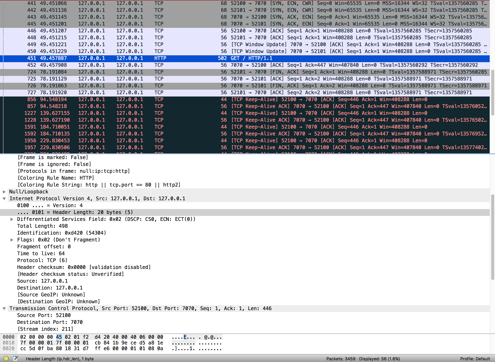
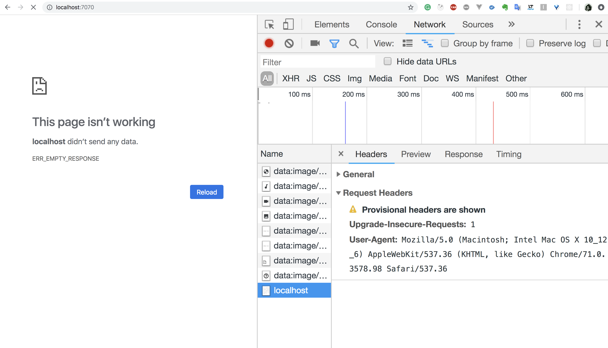
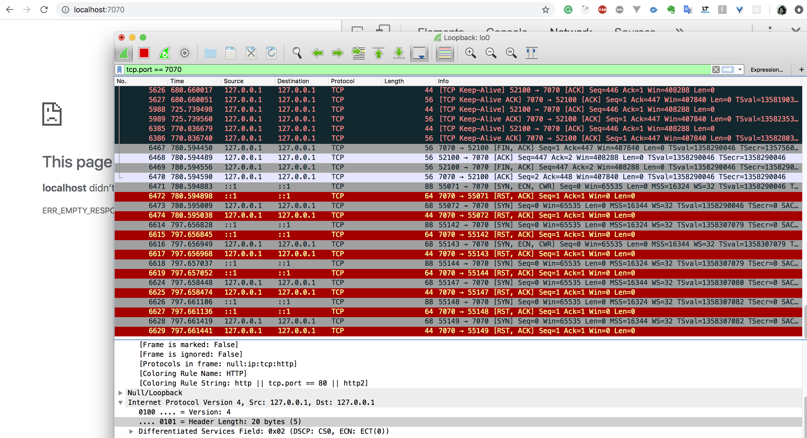

# createServer
服务端代码如下，然后从chrome尝试连接服务器

可以看到：

1. 首先发生三次握手，但是chrome好像通过两个端口连接服务器，另外一个是干什么的呢？
``` bash
# 服务器收到响应
CONNECTED: 127.0.0.1:52100
CONNECTED: 127.0.0.1:52101
```

2. chrome向服务器发起了一个GET请求，

3. 服务器返回一个数据包确认收到

4. chrome等待http response


5. 服务器代码没有这样的逻辑😳😳

6. 服务器向chrome请求结束，但是chrome好像没同意？

7. 双方就这样干等着，一直有keep-alive的数据包传递

8. chrome还是处于pedding 状态


9. 我断开了服务器，然后四次分手


10. 分手后的哪些数据包是干啥子的哦